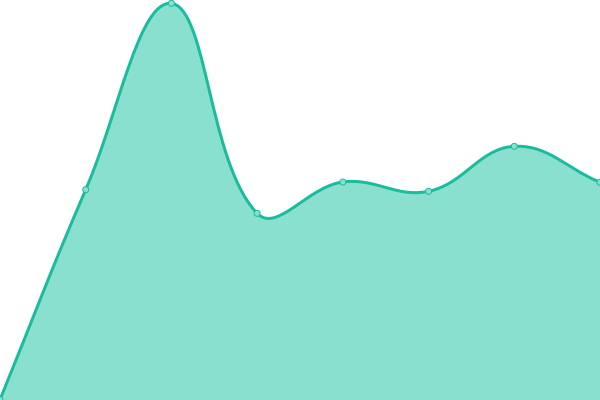

# [📈 Live Status](https://olivierdalang.github.io/upptime): <!--live status--> **🟩 All systems operational**

This repository contains the open-source uptime monitor and status page for [Olivier Dalang](https://olivierdalang.github.io/upptime), powered by [Upptime](https://github.com/upptime/upptime).

With [Upptime](https://upptime.js.org), you can get your own unlimited and free uptime monitor and status page, powered entirely by a GitHub repository. We use [Issues](https://github.com/olivierdalang/upptime/issues) as incident reports, [Actions](https://github.com/olivierdalang/upptime/actions) as uptime monitors, and [Pages](https://olivierdalang.github.io/upptime) for the status page.

<!--start: status pages-->
<!-- This summary is generated by Upptime (https://github.com/upptime/upptime) -->
<!-- Do not edit this manually, your changes will be overwritten -->
<!-- prettier-ignore -->
| URL | Status | History | Response Time | Uptime |
| --- | ------ | ------- | ------------- | ------ |
|  urbasen | 🟩 Up | [urbasen.yml](https://github.com/olivierdalang/upptime/commits/HEAD/history/urbasen.yml) | 

 847ms
     
 | 

<a href="https://olivierdalang.github.io/upptime/history/urbasen">100.00%</a>
    

|  urbadatabase | 🟩 Up | [urbadatabase.yml](https://github.com/olivierdalang/upptime/commits/HEAD/history/urbadatabase.yml) | 

 654ms
     
 | 

<a href="https://olivierdalang.github.io/upptime/history/urbadatabase">100.00%</a>
    

|  inondations-dakar | 🟩 Up | [inondations-dakar.yml](https://github.com/olivierdalang/upptime/commits/HEAD/history/inondations-dakar.yml) | 

 1338ms
     
 | 

<a href="https://olivierdalang.github.io/upptime/history/inondations-dakar">15.37%</a>
    

|  pepinieres-urbaines | 🟩 Up | [pepinieres-urbaines.yml](https://github.com/olivierdalang/upptime/commits/HEAD/history/pepinieres-urbaines.yml) | 

 1049ms
     
 | 

<a href="https://olivierdalang.github.io/upptime/history/pepinieres-urbaines">100.00%</a>
    

|  ici-risk-tool | 🟩 Up | [ici-risk-tool.yml](https://github.com/olivierdalang/upptime/commits/HEAD/history/ici-risk-tool.yml) | 

 595ms
     
 | 

<a href="https://olivierdalang.github.io/upptime/history/ici-risk-tool">100.00%</a>
    

<!--end: status pages-->

[**Visit our status website →**](https://olivierdalang.github.io/upptime)

## 📄 License

- Powered by: [Upptime](https://github.com/upptime/upptime)
- Code: [MIT](./LICENSE) © [Olivier Dalang](https://olivierdalang.github.io/upptime)
- Data in the `./history` directory: [Open Database License](https://opendatacommons.org/licenses/odbl/1-0/)
